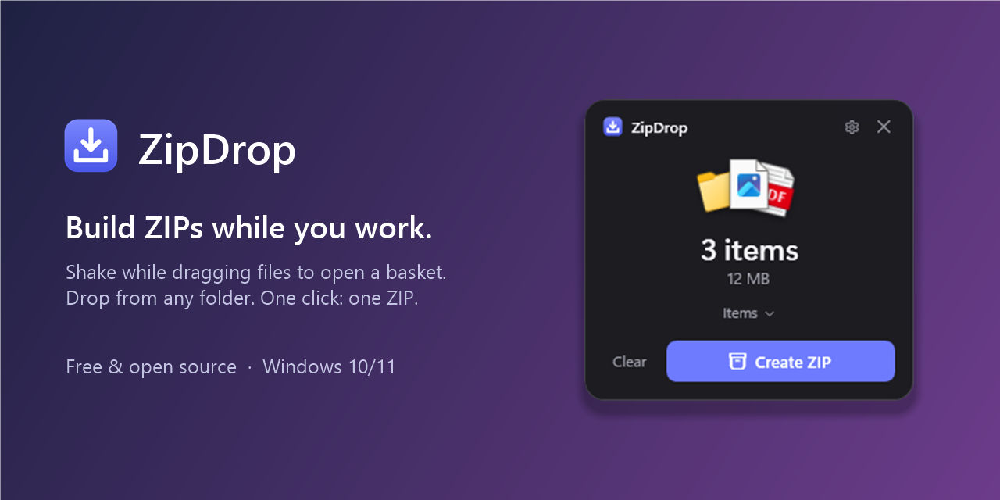
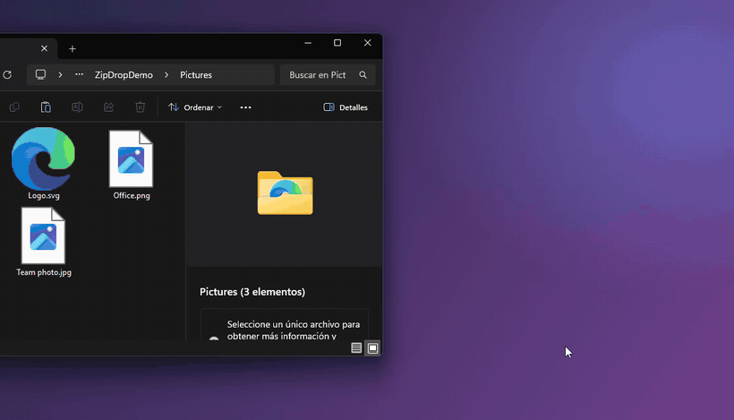
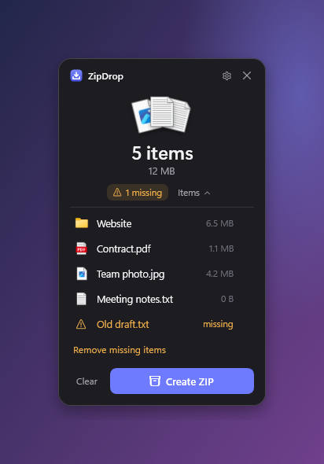
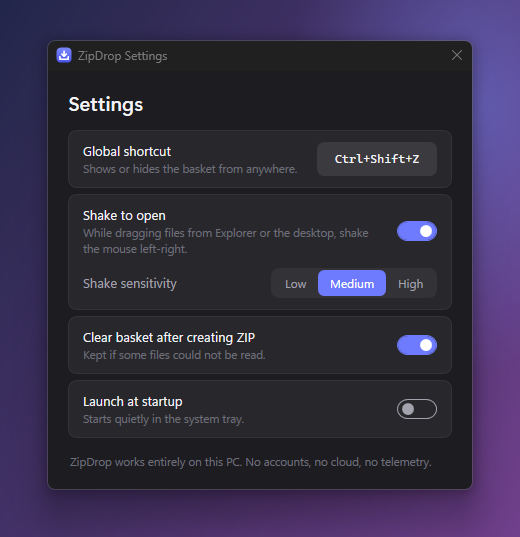

<div align="center">



# ZipDrop

**Build ZIPs while you work.** A tiny Windows utility: collect files from anywhere into a floating
basket, then create one ZIP — no temp folder, no copying, no WinRAR.

[Download](https://github.com/xGaliss/ZipDrop/releases/latest) ·
[How it works](#how-it-works) ·
[Build from source](#build-from-source)

</div>



## Why

You need to send a photo from *Pictures*, a contract from *Documents* and a whole project folder.
Normally: make a temp folder, copy everything in, zip it, delete the temp folder.

With ZipDrop: **drag → shake → drop**, keep working, **drop more**, **Create ZIP**. Done.

```
FILES → SHAKE → DROP → CONTINUE WORKING → MORE FILES → DROP → CREATE ZIP
```

## Features

- **Shake to summon.** While dragging files in File Explorer or on the desktop, shake the mouse
  left-right and the basket appears next to your cursor.
- **Global shortcut.** `Ctrl+Shift+Z` (configurable) shows/hides the basket from anywhere.
- **References, not copies.** Nothing is copied until you zip. Files that get moved or deleted
  meanwhile are flagged as *missing* — you see exactly which one.
- **Safe ZIPs.** Same-named files from different folders become `report.pdf` and `report (2).pdf`;
  nothing is ever silently overwritten. Folders keep their structure, Unicode names and long paths work,
  already-compressed files (photos, videos, Office docs) are stored without wasting CPU.
- **Never touches your originals.** Drops are always *Copy*, never *Move*.
- **Lives in the tray.** ~0.5 MB app, starts in ~0.3 s, idles at a few MB of RAM.
- **Send To.** The installer can add *Send to → ZipDrop* to Explorer's context menu.
- **100% local.** No account, no cloud, no telemetry, no network access at all.

<p align="center">
  
  &nbsp;&nbsp;
  
</p>

## Install

Grab the latest build from [Releases](https://github.com/xGaliss/ZipDrop/releases/latest):

| File | For |
|---|---|
| `ZipDrop-Setup-x.y.z.exe` | Installer (per-user, no admin rights, optional *Send to* and autostart) |
| `ZipDrop-x.y.z-win-x64-portable.zip` | Single portable `.exe`, nothing else needed |
| `ZipDrop-x.y.z-win-x64-framework-dependent.zip` | Tiny build, needs the [.NET 9 Desktop Runtime](https://dotnet.microsoft.com/download/dotnet/9.0) |

Windows 10 (1809+) or Windows 11, x64.

> The builds are not code-signed yet, so SmartScreen may warn the first time
> (*More info → Run anyway*). Prefer building from source? See below.

## How it works

| Do this | To |
|---|---|
| Drag files, **shake** the mouse | Open the basket while dragging (from Explorer, desktop, file dialogs) |
| `Ctrl+Shift+Z` or click the tray icon | Show / hide the basket |
| Drop on the basket | Add files and folders |
| **Items** / **N missing** | See what's inside and what disappeared |
| **Create ZIP** | Pick a name and folder (`Archive.zip` suggested), done |
| **Clear** (click twice) | Empty the basket — your files are never touched |

Tray menu: *Open ZipDrop · New basket · Settings · Exit*. Closing the basket keeps ZipDrop running.

**Shake not firing from some app?** By default only File Explorer/desktop drags count (that's what
keeps false positives away). Use the shortcut or the tray icon from anywhere else.

## Build from source

Requires the .NET 9 SDK on Windows.

```powershell
git clone https://github.com/xGaliss/ZipDrop
cd ZipDrop
dotnet test                         # core tests: basket, ZIP planning/writing, shake detector
dotnet run --project src/ZipDrop    # run it
./build.ps1                         # tests + Release publish to artifacts/publish (+ installer if Inno Setup 6 is installed)
./build.ps1 -SelfContained          # single portable exe
```

Project layout: `src/ZipDrop.Core` (pure, tested logic) · `src/ZipDrop` (WPF UI + Win32 integration) ·
`tests/` · `installer/` · `tools/`.

Developer documentation (in Spanish): [architecture](docs/ARCHITECTURE.md) ·
[design decisions](docs/DECISIONS.md) · [roadmap](docs/ROADMAP.md) · [known issues](docs/KNOWN_ISSUES.md).

## Roadmap

Multiple baskets · open an existing ZIP as a basket · password-protected ZIP · 7z · compression levels ·
drop actions (to folder, upload, share, script). See [ROADMAP](docs/ROADMAP.md).

## Contributing

Issues and PRs welcome — see [CONTRIBUTING](CONTRIBUTING.md). ZipDrop is deliberately small: if a
feature doesn't make *collect → zip* faster, it probably belongs elsewhere.

## License

[MIT](LICENSE) © Alejandro Galisteo
